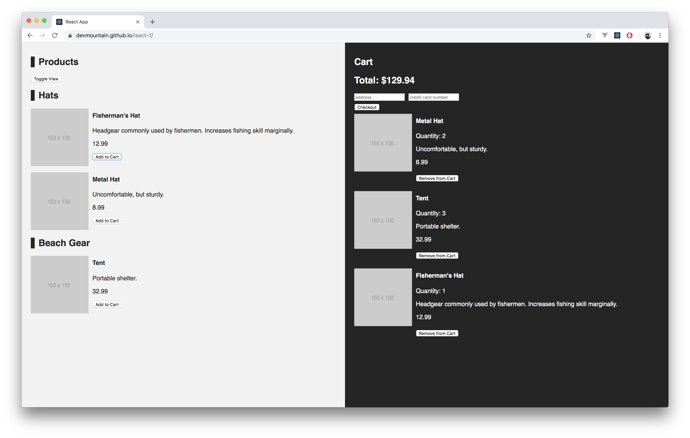
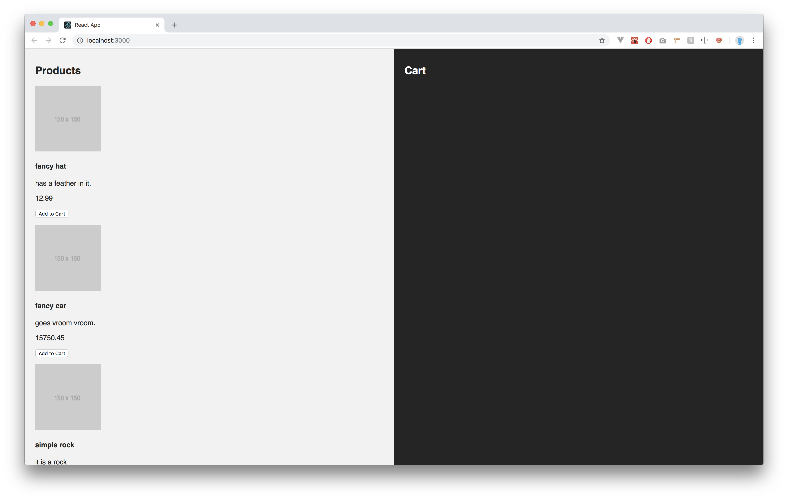
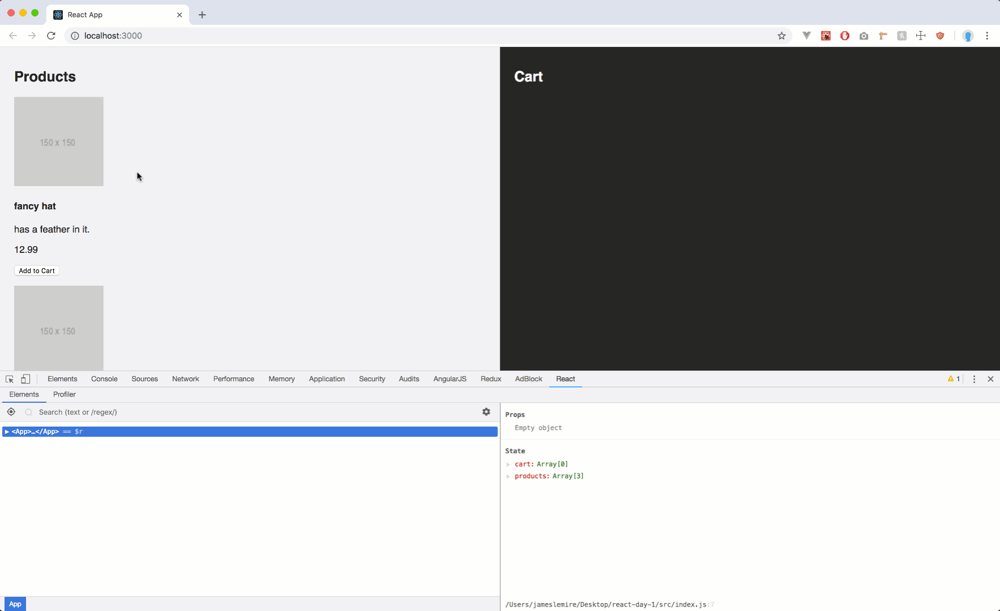
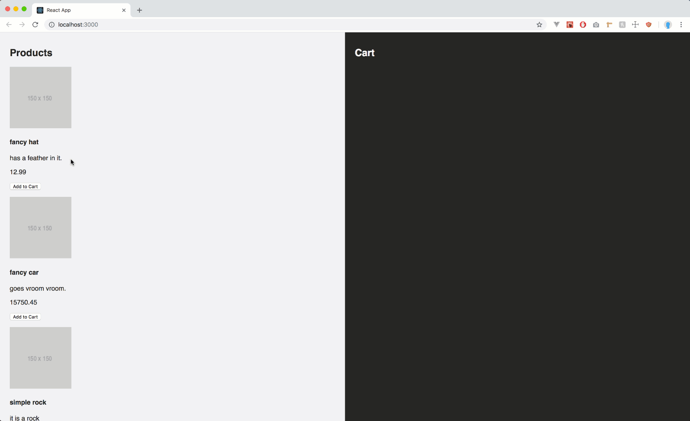
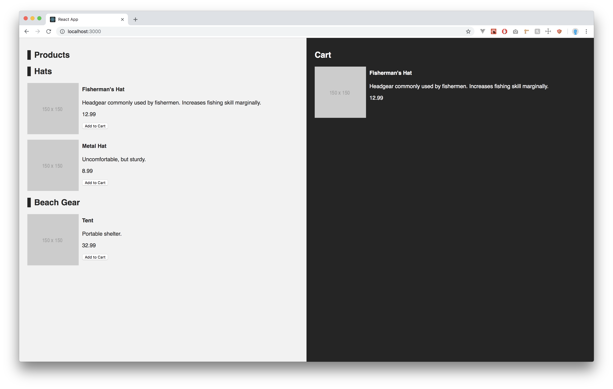
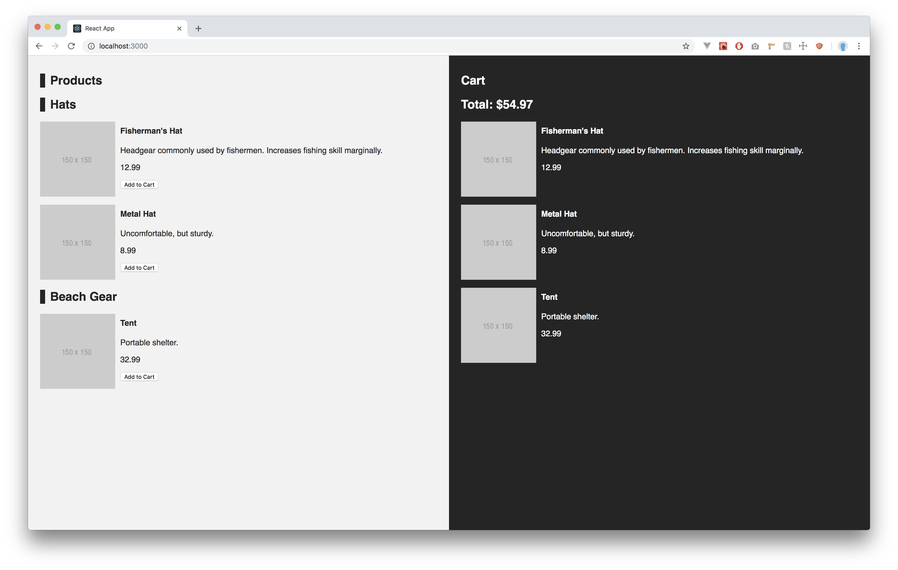
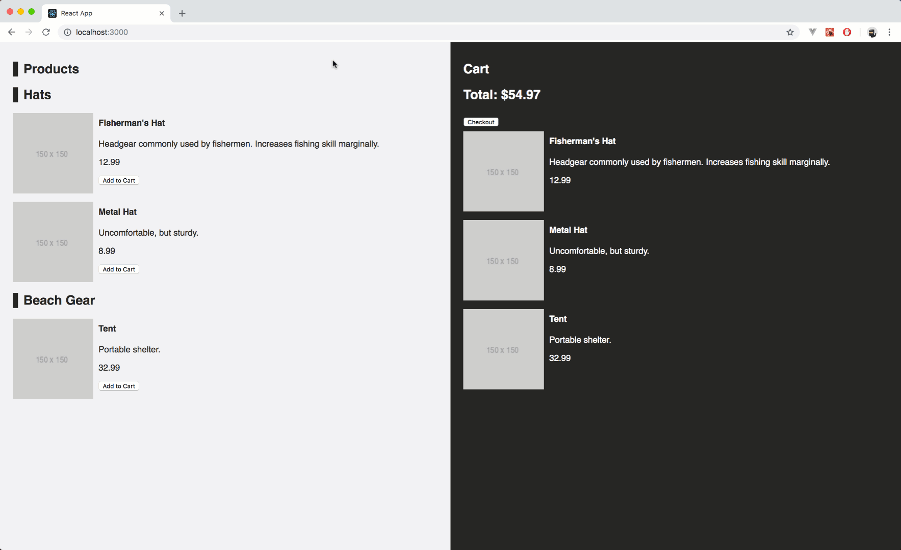
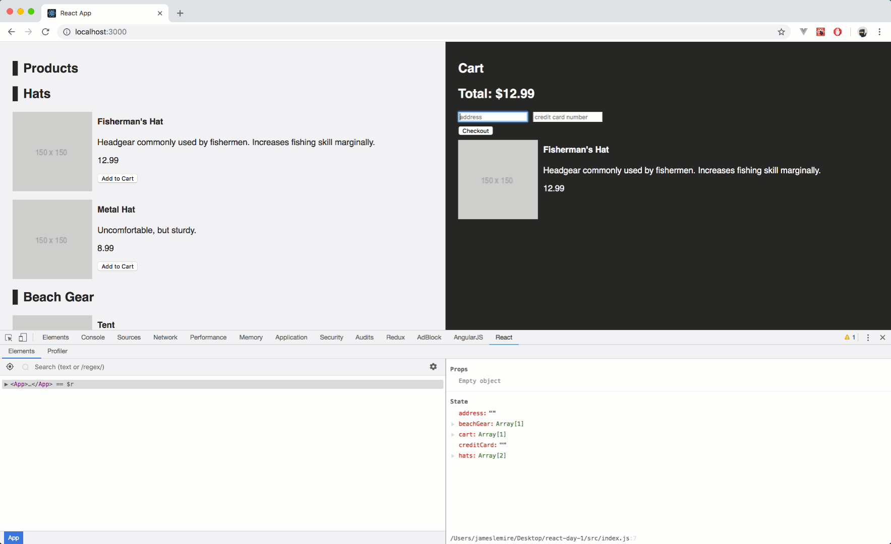
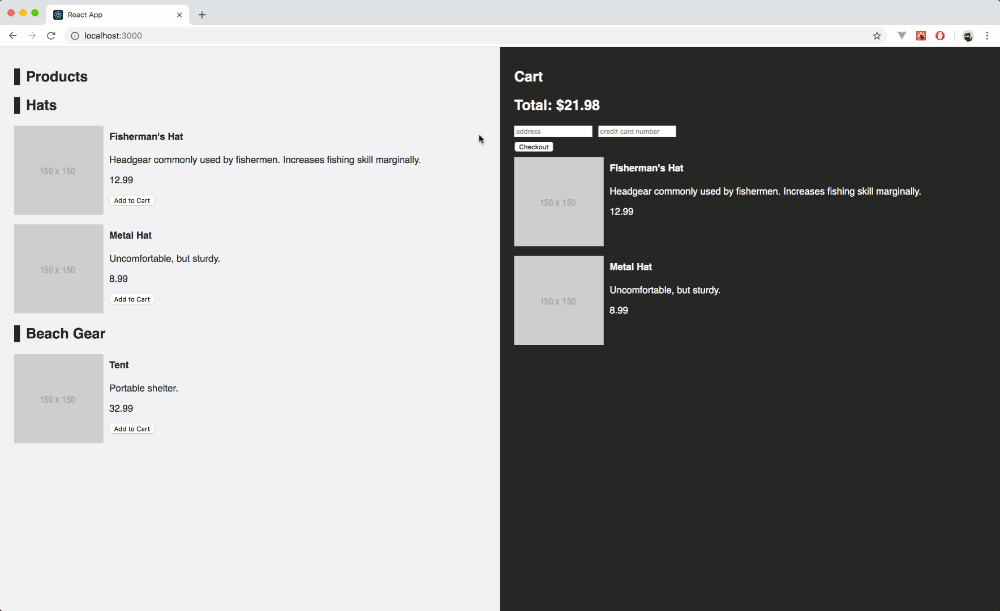

# Project Summary

In this project, we will create an e-commerce React application from start to finish. We will start with the basic file structure from `create-react-app`, with the only difference being that `src/App.js` is empty. We will be working on this app over the course of three days. Each day's project is divided into four parts, with the first step being comparable to that day's mini-project and the following steps adding more features or implementing new patterns. You should expect to be able to complete the first two steps on each day, while steps three and four will offer a challenge.

# Day 1

On this day, we will start building our React app. We will create a `class component` with `state` in the `src/App.js` file. We will practice rendering lists of data from `state` by looping over them and returning `JSX` code. At the end of this project, you should have a better understanding of the following concepts:

- Components
- State
- Conditional Rendering
- Array mapping
- JSX

# Live Example

<a target="_blank" href="https://DevMountain.github.io/react-1-1">Click Me!</a>



## Part 1

### Summary

In this part, we will create a `class component` called `App` and initialize it with `state`. The `state` will be responsible for holding all of the user's products that they want to purchase and all of the products that are available for purchase. We will design the `App` component so that it has a left and right side. On the left side we will display the list of products available to purchase. On the right side will be the user's cart.

We will also add the functionality for a user to be able to add items to their cart. For right now, if a duplicate is added to the cart, we will just add to the duplicate to the cart. We will optimize this on a later part.

## Step 1

- Open `src/App.js`.
- Create a `class component` called `App` that is the default export.

<details>
<summary> Detailed Instructions </summary>
<br />

Let's begin by opening `src/App.js` and creating a `class component`. We'll call this component `App` and make it the `default export`.

```js
import React, { Component } from "react";

export default class App extends Component {}
```

</details>

### Solution

<details>

<summary> <code> src/App.js </code> </summary>
<br />

```js
import React, { Component } from "react";

export default class App extends Component {}
```

</details>

## Step 2

- Open `src/App.js`.
- Create a `constructor method` and initialize `state` as an empty `object` for now.
- Create an `array` on `state` called `products`.
  - Populate `products` with a few `product objects` of your choosing.
  - A `product object` should be represented by an `object` with the following properties:
    - `id` - `Number`.
    - `imageUrl` - `String`.
    - `title` - `String`.
    - `price` - `Number`.
    - `description` - `String`.
- Create an empty `array` on `state` called `cart`.

<details>
<summary> Detailed Instructions </summary>
<br />

Let's begin by opening `src/App.js` and create a `constructor method`. In order for a `constructor` to have access to `state` we will need to call the `super` method. We will also initialize `state` as an empty `object` for now.

```js
export default class App extends Component {
  constructor() {
    super();
    this.state = {};
  }
}
```

Now that we have a `constructor method` and `state`. Let's create an `array` called `products`. This `array` will hold all the products available for purchase. You can either make up your own or follow along. The important part is that a `product` is represented by an `object`. This `object` should have the following properties - data types.

- `id` - `Number`.
- `imageUrl` - `String`.
- `title` - `String`.
- `price` - `Number`.
- `description` - `String`.

```js
constructor() {
  super();
  this.state = {
    products: [
      {
        id: 1,
        imageUrl: 'https://via.placeholder.com/150x150',
        title: 'fancy hat',
        price: 12.99,
        description: 'has a feather in it.'
      },
      {
        id: 2,
        imageUrl: 'https://via.placeholder.com/150x150',
        title: 'fancy car',
        price: 15750.45,
        description: 'goes vroom vroom.'
      },
      {
        id: 3,
        imageUrl: 'https://via.placeholder.com/150x150',
        title: 'simple rock',
        price: 5.00,
        description: 'it is a rock'
      }
    ]
  }
}
```

Lastly, we'll need another property on `state` called `cart` and initialize it as an empty `array`. This `array` will hold all the `products` that a user wishes to purchase.

```js
constructor() {
  super();
  this.state = {
    products: [
      {
        id: 1,
        imageUrl: 'https://via.placeholder.com/150x150',
        title: 'fancy hat',
        price: 12.99,
        description: 'has a feather in it.'
      },
      {
        id: 2,
        imageUrl: 'https://via.placeholder.com/150x150',
        title: 'fancy car',
        price: 15750.45,
        description: 'goes vroom vroom.'
      },
      {
        id: 3,
        imageUrl: 'https://via.placeholder.com/150x150',
        title: 'simple rock',
        price: 5.00,
        description: 'it is a rock'
      }
    ],
    cart: []
  }
}
```

</details>

### Solution

<details>

<summary> <code> src/App.js </code> </summary>
<br />

```js
import React, { Component } from "react";

export default class App extends Component {
  constructor() {
    super();
    this.state = {
      products: [
        {
          id: 1,
          imageUrl: "https://via.placeholder.com/150x150",
          title: "fancy hat",
          price: 12.99,
          description: "has a feather in it."
        },
        {
          id: 2,
          imageUrl: "https://via.placeholder.com/150x150",
          title: "fancy car",
          price: 15750.45,
          description: "goes vroom vroom."
        },
        {
          id: 3,
          imageUrl: "https://via.placeholder.com/150x150",
          title: "simple rock",
          price: 5.0,
          description: "it is a rock"
        }
      ],
      cart: []
    };
  }
}
```

</details>

## Step 3

- Open `src/App.js`.
- Create a `render method` underneath the `constructor method`.
- Create two `section` elements in the `return statement` of `App`'s `render method`.
  - The first will hold the products list and the other will hold the cart list.
  - Create an `h1` element for each of these sections.
    - Label them as Products and Cart respectively.
- Make sure to only return one element to avoid an error.

<details>
<summary>Detailed Instructions</summary>
<br />

Let's begin by opening `src/App.js` and creating a `render method`. The `render method` should use a `return statement` to determine what `JSX` it should render onto the DOM. In this case we want to `render` two `section` elements with their own `h1` element. Each `section` represents a "side" of the app. The first `section` will be the left side and the second `section` will be the right side.

Remember that a `render method` can only `return` one element. We will use a parent `div` as a container for our `section` and `h1` elements.

```js
render(){
  return(
    <div className="App">
      <section className="products">
        <h1>Products</h1>
      </section>

      <section className="cart">
        <h1>Cart</h1>
      </section>
    </div>
  )
}
```

</details>

### Solution

<details>

<summary> <code> src/App.js </code> </summary>
<br />

```js
import React, { Component } from "react";

export default class App extends Component {
  constructor() {
    super();
    this.state = {
      products: [
        {
          id: 1,
          imageUrl: "https://via.placeholder.com/150x150",
          title: "fancy hat",
          price: 12.99,
          description: "has a feather in it."
        },
        {
          id: 2,
          imageUrl: "https://via.placeholder.com/150x150",
          title: "fancy car",
          price: 15750.45,
          description: "goes vroom vroom."
        },
        {
          id: 3,
          imageUrl: "https://via.placeholder.com/150x150",
          title: "simple rock",
          price: 5.0,
          description: "it is a rock"
        }
      ],
      cart: []
    };
  }

  render() {
    return (
      <div className="App">
        <section className="products">
          <h1>Products</h1>
        </section>

        <section className="cart">
          <h1>Cart</h1>
        </section>
      </div>
    );
  }
}
```

</details>

## Step 4

- Open `src/App.js`.
- In the product's `section`:
  - Use a map on the `products` array on `state` that returns `JSX` to render the `product`'s information.
    - Use an `img` element for the `product`'s `imageUrl`.
    - Use an `h4` element for the `product`'s `title`.
    - Use a `p` element for the `product`'s `description`.
    - Use a `p` element for the `product`'s `price`.
  - Also include a `button` that says "Add to Cart" for each `product` in the returned `JSX`.
  - Remeber to assign a `key` to the most parent element of the mapping to avoid an error.
    - You can use the `product`'s `id` as a `key` since it is unique.

<details>
<summary>Detailed Instructions</summary>
<br />

Let's begin by opening `src/App.js` and scrolling down to `JSX` for the products `section`. Underneath the `h1` element, let's use `{}` to break out of `JSX` and execute some `JavaScript`. We want to map over the `products` array on `state` and `return` a combination of elements to render all the information about the `product`. We'll want to use:

- An `img` element for the `product`'s `imageUrl`.
- An `h4` element for the `product`'s `title`.
- A `p` element for the `product`'s `description`.
- A `p` element for the `product`'s `price`.

Remember that when mapping `JSX` elements the most parent element needs a `key` to avoid an error. We can use the `product`'s `id` as the `key` since it is unique across all `products`.

```js
<section className="products">
  <h1>Products</h1>
  {this.state.products.map(item => (
    <div key={item.id} className="product">
      
      <h4>{item.title}</h4>
      <p>{item.description}</p>
      <p>{item.price}</p>
      <button>Add to Cart</button>
    </div>
  ))}
</section>
```

</details>

### Solution

<details>

<summary> <code> src/App.js </code> </summary>
<br />

```js
import React, { Component } from "react";
import "./App.css";

export default class App extends Component {
  constructor() {
    super();
    this.state = {
      products: [
        {
          id: 1,
          imageUrl: "https://via.placeholder.com/150x150",
          title: "fancy hat",
          price: 12.99,
          description: "has a feather in it."
        },
        {
          id: 2,
          imageUrl: "https://via.placeholder.com/150x150",
          title: "fancy car",
          price: 15750.45,
          description: "goes vroom vroom."
        },
        {
          id: 3,
          imageUrl: "https://via.placeholder.com/150x150",
          title: "simple rock",
          price: 5.0,
          description: "it is a rock"
        }
      ],
      cart: []
    };
  }

  render() {
    return (
      <div className="App">
        <section className="products">
          <h1>Products</h1>
          {this.state.products.map(item => (
            <div key={item.id} className="product">
              
              <h4>{item.title}</h4>
              <p>{item.description}</p>
              <p>{item.price}</p>
              <button>Add to Cart</button>
            </div>
          ))}
        </section>

        <section className="cart">
          <h1>Cart</h1>
        </section>
      </div>
    );
  }
}
```

</details>

<br/>

Take the time to make your UI look similar to the UI below using CSS. CSS is not the main take away here. Do not stress about making it a perfect pixel/color match.



## Step 5

- Open `src/App.js`.
- Create a new `method` above the `render method` called `addToCart`.
  - This `method` should use one `parameter` to determine what `product` to add into the `cart` array on `state`.
  - This `method` should use the value of that `parameter` to push the new cart item into the `cart` array on `state`.
- Add an `onClick` handler to call `addToCart` on the `Add to Cart` button.
  - Remember to call the `method` with the `item` to add.
  - Remember to wrap the `method` call in an `arrow function` to avoid an infinite call stack error.

<details>
<summary>Detailed Instructions</summary>
<br />

Let's begin by opening `src/App.js` and going above the `render method`. We want to create a new `method` here called `addToCart`. This `method` will be responsible for handling the addition of a new `product` into the user's `cart` array on `state`. We can use a `parameter` here to make the method dynamic. By dynamic I mean capable of adding any `product` into the `cart`.

We can use a handy `es6` feature here to copy all the `product`s that are already in the `cart` and simply add our new `product` in afterwards. This is called the `spread` operator. It is used by saying `...Array`. Where `Array` is the array you want to copy.

```js
addToCart(item){
  this.setState({
      // Copy all products already in the cart array
      // then push our new item into the end of the cart array
      cart: [...this.state.cart, item]
  })
}
```

Now that our new `method` is ready. Let's assign a new `onClick` handler for the `Add to Cart` button. Remember that if you need to call a `method` with an `argument` you need to wrap the `method` invocation in an `arrow function`. Otherwise, you will get an infinite call stack error.

```js
<button onClick={() => this.addToCart(item)}>Add to Cart</button>
```

</details>

### Solution

<details>

<summary> <code> src/App.js </code> </summary>
<br />

```js
import React, { Component } from "react";
import "./App.css";

export default class App extends Component {
  constructor() {
    super();
    this.state = {
      products: [
        {
          id: 1,
          imageUrl: "https://via.placeholder.com/150x150",
          title: "fancy hat",
          price: 12.99,
          description: "has a feather in it."
        },
        {
          id: 2,
          imageUrl: "https://via.placeholder.com/150x150",
          title: "fancy car",
          price: 15750.45,
          description: "goes vroom vroom."
        },
        {
          id: 3,
          imageUrl: "https://via.placeholder.com/150x150",
          title: "simple rock",
          price: 5.0,
          description: "it is a rock"
        }
      ],
      cart: []
    };
  }

  addToCart(item) {
    this.setState({
      cart: [...this.state.cart, item]
    });
  }

  render() {
    return (
      <div className="App">
        <section className="products">
          <h1>Products</h1>
          {this.state.products.map(item => (
            <div key={item.id} className="product">
              
              <h4>{item.title}</h4>
              <p>{item.description}</p>
              <p>{item.price}</p>
              <button onClick={() => this.addToCart(item)}>Add to Cart</button>
            </div>
          ))}
        </section>

        <section className="cart">
          <h1>Cart</h1>
        </section>
      </div>
    );
  }
}
```

</details>

<br />



## Step 6

- Open `src/App.js`.
- In the cart's `section`:
  - Use a map on the `cart` array on `state` that returns `JSX` to render the `cart`'s information.
    - Use an `img` element for the `product`'s `imageUrl`.
    - Use an `h4` element for the `product`'s `title`.
    - Use a `p` element for the `product`'s `description`.
    - Use a `p` element for the `product`'s `price`.
  - Remeber to assign a `key` to the most parent element of the mapping to avoid an error.
    - You can use the `product`'s `id` as a `key` since it is unique.

<details>
<summary>Detailed Instructions</summary>
<br />

Let's begin by opening `src/App.js` and scrolling down to JSX for the cart `section`. Underneath the `h1` element, let's use `{}` to break out of `JSX` and execute some `JavaScript`. We want to map over the `cart` array on `state` and `return` a combination of elements to render all the information about the `product` in the `cart`. We'll want to use:

- An `img` element for the `product`'s `imageUrl`.
- An `h4` element for the `product`'s `title`.
- A `p` element for the `product`'s `description`.
- A `p` element for the `product`'s `price`.

Remember that when mapping `JSX` elements, the most parent element needs a `key` to avoid an error. We can use the `product`'s `id` as the `key` since it is unique across all `products`.

```js
<section className="cart">
  <h1>Cart</h1>
  {this.state.cart.map(item => (
    <div key={item.id} className="product">
      
      <h4>{item.title}</h4>
      <p>{item.description}</p>
      <p>{item.price}</p>
    </div>
  ))}
</section>
```

</details>

### Solution

<details>

<summary> <code> src/App.js </code> </summary>
<br />

```js
import React, { Component } from "react";
import "./App.css";

export default class App extends Component {
  constructor() {
    super();
    this.state = {
      products: [
        {
          id: 1,
          imageUrl: "https://via.placeholder.com/150x150",
          title: "fancy hat",
          price: 12.99,
          description: "has a feather in it."
        },
        {
          id: 2,
          imageUrl: "https://via.placeholder.com/150x150",
          title: "fancy car",
          price: 15750.45,
          description: "goes vroom vroom."
        },
        {
          id: 3,
          imageUrl: "https://via.placeholder.com/150x150",
          title: "simple rock",
          price: 5.0,
          description: "it is a rock"
        }
      ],
      cart: []
    };
  }

  addToCart(item) {
    this.setState({
      cart: [...this.state.cart, item]
    });
  }

  render() {
    return (
      <div className="App">
        <section className="products">
          <h1>Products</h1>
          {this.state.products.map(item => (
            <div key={item.id} className="product">
              
              <h4>{item.title}</h4>
              <p>{item.description}</p>
              <p>{item.price}</p>
              <button onClick={() => this.addToCart(item)}>Add to Cart</button>
            </div>
          ))}
        </section>

        <section className="cart">
          <h1>Cart</h1>
          {this.state.cart.map(item => (
            <div key={item.id} className="product">
              
              <h4>{item.title}</h4>
              <p>{item.description}</p>
              <p>{item.price}</p>
            </div>
          ))}
        </section>
      </div>
    );
  }
}
```

</details>

<br />



## Part 2

### Summary

In this part, we will calculate and display the total price from the `products` in the `cart` on `state`. We will organize the `products` into categories and store them in seperate `arrays` on `state`. We'll then display the `products` by category with a `header` element to distinguish the different types of `products`. We'll also create a checkout `button` on the cart side that when clicked will empty out a user's `cart` on `state` and display an `alert` as a confirmation.

## Step 1

- Open `src/App.js`.
- Create new properties on `state` for different categories of `products`.
  - These properties should equal an `array`.
  - You can make up however many you would like. Some examples are:
    - `shirts: []`.
    - `pants: []`.
    - `hats: []`.
- Move your `product objects` out of the `products` property on `state` into your new categories.
- Delete the old `products` property from `state`.

_This will break your application until we finish step 2._

<details>
<summary> Detailed Instructions </summary>
<br />

Let's begin by opening `src/App.js` and going to the `state object`. We're going to add new properties onto `state` that represent `product` categories. You can either make up your own or follow along. After we have made our new `categories` we can either move our existing `products` into the categories or make up brand new products. Lastly, we will delete the old `products` property.

_This will break your application until we finish step 2._

```js
this.state = {
  cart: [],
  hats: [
    {
      id: 1,
      title: "Fisherman's Hat",
      description:
        "Headgear commonly used by fishermen. Increases fishing skill marginally.",
      price: 12.99,
      imageUrl: "https://via.placeholder.com/150x150"
    },
    {
      id: 2,
      title: "Metal Hat",
      description: "Uncomfortable, but sturdy.",
      price: 8.99,
      imageUrl: "https://via.placeholder.com/150x150"
    }
  ],
  beachGear: [
    {
      id: 3,
      title: "Tent",
      description: "Portable shelter.",
      price: 32.99,
      imageUrl: "https://via.placeholder.com/150x150"
    }
  ]
};
```

</details>

### Solution

<details>

<summary> <code> src/App.js (just the constructor method) </code> </summary>
<br />

```js
constructor() {
  super();
  this.state = {
    cart: [],
    hats: [
      {
        id: 1,
        title: "Fisherman's Hat",
        description:
          "Headgear commonly used by fishermen. Increases fishing skill marginally.",
        price: 12.99,
        imageUrl: "https://via.placeholder.com/150x150"
      },
      {
        id: 2,
        title: "Metal Hat",
        description: "Uncomfortable, but sturdy.",
        price: 8.99,
        imageUrl: "https://via.placeholder.com/150x150"
      }
    ],
    beachGear: [
      {
        id: 3,
        title: "Tent",
        description: "Portable shelter.",
        price: 32.99,
        imageUrl: "https://via.placeholder.com/150x150"
      }
    ]
  };
}
```

</details>

## Step 2

- Open `src/App.js`.
- Scroll down to the `products section`:
  - Remove the old map logic for `products`.
  - Create a map for every category on your `state`.
    - Just before the logic of the map. Add an `h2` element just above it for the categories name.
  - The returned JSX should be almost the same as before:
    - Use an `img` element for the `product`'s `imageUrl`.
    - Use an `h4` element for the `product`'s `title`.
    - Use a `p` element for the `product`'s `description`.
    - Use a `p` element for the `product`'s `price`.
- Add your own JSX/CSS to make the `product`'s information appear on the right side of the `product`'s `imageUrl`.
  - Do this for the `products` that appear in the `cart` as well.

<details>

<summary> Detailed Instructions </summary>
<br />

Let's begin by opening `src/App.js` and scrolling down to the `products section` in the `render method`. We're going to remove the old mapping logic on `products array` on `state` because `products` no longer exists on `state`. Instead we are going to replace it with a map for every category on our `state`. In addition to the new maps we are going to add an `h2` element just before it to visually display what category it is.

```js
<section className="products">
  <h1>Products</h1>
  <h2>Hats</h2>
  {this.state.hats.map(item => (
    <div key={item.id} className="product">
      
      <div className="product-info">
        <h4>{item.title}</h4>
        <p>{item.description}</p>
        <p>{item.price}</p>
        <button onClick={() => this.addToCart(item)}>Add to Cart</button>
      </div>
    </div>
  ))}

  <h2>Beach Gear</h2>
  {this.state.beachGear.map(item => (
    <div key={item.id} className="product">
      
      <div className="product-info">
        <h4>{item.title}</h4>
        <p>{item.description}</p>
        <p>{item.price}</p>
        <button onClick={() => this.addToCart(item)}>Add to Cart</button>
      </div>
    </div>
  ))}
</section>
```

You may have noticed my `h4` and `p` elements are wrapped in a `div`. I did this to make it easier to use `CSS` to move that information to the right of the `product`'s `imageUrl`. Using the same `className` I can apply to this to every map for `products` and `cart` `section`s.

```js
<section className="cart">
  <h1>Cart</h1>
  {this.state.cart.map(item => (
    <div key={item.id} className="product">
      
      <div className="product-info">
        <h4>{item.title}</h4>
        <p>{item.description}</p>
        <p>{item.price}</p>
      </div>
    </div>
  ))}
</section>
```

</details>

### Solution

<details>

<summary> <code> src/App.js </code> </summary>
<br />

```js
import React, { Component } from "react";
import "./App.css";

export default class App extends Component {
  constructor() {
    super();
    this.state = {
      cart: [],
      hats: [
        {
          id: 1,
          title: "Fisherman's Hat",
          description:
            "Headgear commonly used by fishermen. Increases fishing skill marginally.",
          price: 12.99,
          imageUrl: "https://via.placeholder.com/150x150"
        },
        {
          id: 2,
          title: "Metal Hat",
          description: "Uncomfortable, but sturdy.",
          price: 8.99,
          imageUrl: "https://via.placeholder.com/150x150"
        }
      ],
      beachGear: [
        {
          id: 3,
          title: "Tent",
          description: "Portable shelter.",
          price: 32.99,
          imageUrl: "https://via.placeholder.com/150x150"
        }
      ]
    };
  }

  addToCart(item) {
    this.setState({
      cart: [...this.state.cart, item]
    });
  }

  render() {
    return (
      <div className="App">
        <section className="products">
          <h1>Products</h1>
          <h2>Hats</h2>
          {this.state.hats.map(item => (
            <div key={item.id} className="product">
              
              <div className="product-info">
                <h4>{item.title}</h4>
                <p>{item.description}</p>
                <p>{item.price}</p>
                <button onClick={() => this.addToCart(item)}>
                  Add to Cart
                </button>
              </div>
            </div>
          ))}

          <h2>Beach Gear</h2>
          {this.state.beachGear.map(item => (
            <div key={item.id} className="product">
              
              <div className="product-info">
                <h4>{item.title}</h4>
                <p>{item.description}</p>
                <p>{item.price}</p>
                <button onClick={() => this.addToCart(item)}>
                  Add to Cart
                </button>
              </div>
            </div>
          ))}
        </section>

        <section className="cart">
          <h1>Cart</h1>
          {this.state.cart.map(item => (
            <div key={item.id} className="product">
              
              <div className="product-info">
                <h4>{item.title}</h4>
                <p>{item.description}</p>
                <p>{item.price}</p>
              </div>
            </div>
          ))}
        </section>
      </div>
    );
  }
}
```

</details>



## Step 3

- Open `src/App.js`.
- Scroll down to the `cart section`:
  - Create an`h2` element to display "Total $" and then the actual total after the dollar sign.
  - Place this `h2` under the `h1` for that says "Cart".

<details>
<summary>Detailed Instructions</summary>
<br />

Let's begin by opening `src/App.js` and scrolling down to the `cart section`. We're going to add a sub header that displays the user's current total. Underneath the `h1` element that says "Cart", let's add an `h2` element that says "Total $". After the dollar sign we want to add the actual total number.

We can use a high order function known as `reduce`. `reduce` can loop through an array and preform multiple operations for every element and then return a single value. This is perfect for us to determine the `cart`'s total. A `reduce` is used by calling:

```js
Array.reduce((total, elem) => {}, initialValue);
```

We can use this example to construct a `reduce` for our case. In our case the `Array` is `this.state.cart`. I'm going to name `total` to be `totalPrice` and `elem` to be `product` since the `reduce` is looping through `products` and we are trying to determine the total price. I'm also going to set `initialValue` to be `0` since a `cart` with no `products` should cost `0` dollars.

```js
this.state.cart.reduce((totalPrice, product) => {}, 0);
```

Now we just need to tell the `reduce` what logic to execute. Since every `product` has a price and we want `totalPrice` to equal the cost of all the `products` we can say:

```js
this.state.cart.reduce(
  (totalPrice, product) => (totalPrice += product.price),
  0
);
```

Now `totalPrice` will hold the value of all the `product`'s `price`s added together. Using this logic we can add it to the DOM using:

```js
<h2>
  Total: $
  {this.state.cart.reduce(
    (totalPrice, product) => (totalPrice += product.price),
    0
  )}
</h2>
```

</details>

### Solution

<details>

<summary> <code> src/App.js </code> </summary>
<br />

```js
import React, { Component } from "react";
import "./App.css";

export default class App extends Component {
  constructor() {
    super();
    this.state = {
      cart: [],
      hats: [
        {
          id: 1,
          title: "Fisherman's Hat",
          description:
            "Headgear commonly used by fishermen. Increases fishing skill marginally.",
          price: 12.99,
          imageUrl: "https://via.placeholder.com/150x150"
        },
        {
          id: 2,
          title: "Metal Hat",
          description: "Uncomfortable, but sturdy.",
          price: 8.99,
          imageUrl: "https://via.placeholder.com/150x150"
        }
      ],
      beachGear: [
        {
          id: 3,
          title: "Tent",
          description: "Portable shelter.",
          price: 32.99,
          imageUrl: "https://via.placeholder.com/150x150"
        }
      ]
    };
  }

  addToCart(item) {
    this.setState({
      cart: [...this.state.cart, item]
    });
  }

  render() {
    return (
      <div className="App">
        <section className="products">
          <h1>Products</h1>
          <h2>Hats</h2>
          {this.state.hats.map(item => (
            <div key={item.id} className="product">
              
              <div className="product-info">
                <h4>{item.title}</h4>
                <p>{item.description}</p>
                <p>{item.price}</p>
                <button onClick={() => this.addToCart(item)}>
                  Add to Cart
                </button>
              </div>
            </div>
          ))}

          <h2>Beach Gear</h2>
          {this.state.beachGear.map(item => (
            <div key={item.id} className="product">
              
              <div className="product-info">
                <h4>{item.title}</h4>
                <p>{item.description}</p>
                <p>{item.price}</p>
                <button onClick={() => this.addToCart(item)}>
                  Add to Cart
                </button>
              </div>
            </div>
          ))}
        </section>

        <section className="cart">
          <h1>Cart</h1>
          <h2>
            Total: $
            {this.state.cart.reduce(
              (totalPrice, product) => (totalPrice += product.price),
              0
            )}
          </h2>
          {this.state.cart.map(item => (
            <div key={item.id} className="product">
              
              <div className="product-info">
                <h4>{item.title}</h4>
                <p>{item.description}</p>
                <p>{item.price}</p>
              </div>
            </div>
          ))}
        </section>
      </div>
    );
  }
}
```

</details>



## Step 4

- Open `src/App.js`.
- Scroll down to the `cart section`:
  - Create a new button that says "Checkout".
    - Add this button underneath the `h2` element.
    - Add an `onClick` handler that calls a `method` called `checkout`.
- Scroll above the `render method`:
  - Create a new `method` called `checkout`.
    - This `method` should empty the cart.
    - This `method` should display an alert that says "Purchase is complete!".

<details>

<summary> Detailed Instructions </summary>
<br />

Let's begin by opening `src/App.js` and scrolling down to the `cart section`. Underneath the `h2` element we are going to create a new `button` element that says "Checkout" and uses an `onClick` handler that calls a new `checkout method`.

```js
<button onClick={this.checkout}>Checkout</button>
```

Now we need to actually make the `checkout method`. Let's scroll above the render method and add it. This method will need the correct context of `this` so we can update `cart` to an empty `array`. There are three ways to accomplish this. You could modify the `onClick` handler to use an `arrow function`. You could use `this.checkout = this.checkout.bind(this)` in the constructor method. Or you could make the method an `arrow function`. I'm going to make the method an `arrow function`.

Remember the method needs to set `cart` to an empty `array` and also call an `alert` with "Purchase is complete!".

```js
checkout = () => {
  this.setState({ cart: [] });
  alert("Purchase is complete!");
};
```

</details>

### Solution

<details>

<summary> <code> src/App.js </code> </summary>
<br />

```js
import React, { Component } from "react";
import "./App.css";

export default class App extends Component {
  constructor() {
    super();
    this.state = {
      cart: [],
      hats: [
        {
          id: 1,
          title: "Fisherman's Hat",
          description:
            "Headgear commonly used by fishermen. Increases fishing skill marginally.",
          price: 12.99,
          imageUrl: "https://via.placeholder.com/150x150"
        },
        {
          id: 2,
          title: "Metal Hat",
          description: "Uncomfortable, but sturdy.",
          price: 8.99,
          imageUrl: "https://via.placeholder.com/150x150"
        }
      ],
      beachGear: [
        {
          id: 3,
          title: "Tent",
          description: "Portable shelter.",
          price: 32.99,
          imageUrl: "https://via.placeholder.com/150x150"
        }
      ]
    };
  }

  addToCart(item) {
    this.setState({
      cart: [...this.state.cart, item]
    });
  }

  checkout = () => {
    this.setState({ cart: [] });
    alert("Purchase is complete!");
  };

  render() {
    return (
      <div className="App">
        <section className="products">
          <h1>Products</h1>
          <h2>Hats</h2>
          {this.state.hats.map(item => (
            <div key={item.id} className="product">
              
              <div className="product-info">
                <h4>{item.title}</h4>
                <p>{item.description}</p>
                <p>{item.price}</p>
                <button onClick={() => this.addToCart(item)}>
                  Add to Cart
                </button>
              </div>
            </div>
          ))}

          <h2>Beach Gear</h2>
          {this.state.beachGear.map(item => (
            <div key={item.id} className="product">
              
              <div className="product-info">
                <h4>{item.title}</h4>
                <p>{item.description}</p>
                <p>{item.price}</p>
                <button onClick={() => this.addToCart(item)}>
                  Add to Cart
                </button>
              </div>
            </div>
          ))}
        </section>

        <section className="cart">
          <h1>Cart</h1>
          <h2>
            Total: $
            {this.state.cart.reduce(
              (totalPrice, product) => (totalPrice += product.price),
              0
            )}
          </h2>
          <button onClick={this.checkout}>Checkout</button>
          {this.state.cart.map(item => (
            <div key={item.id} className="product">
              
              <div className="product-info">
                <h4>{item.title}</h4>
                <p>{item.description}</p>
                <p>{item.price}</p>
              </div>
            </div>
          ))}
        </section>
      </div>
    );
  }
}
```

</details>

<br />


## Part 3

### Summary

In this part, we will add two text input fields on the cart side of our app. These will take in a mailing address and a credit-card number from the user. We want to verify that these fields have been filled out and are not empty when the user goes to checkout. If the user attempts to checkout without filling out both of these fields, call an alert which will inform them of the error.

## Step 1

- Open `src/App.js`.
- Add two new properties onto `state`:
  - `address` initialized as `''`.
  - `creditCard` initialized as `''`.
- Scroll down to the `cart section`:
  - Create a `div` element that holds two `input` elements.
    - Move this `div` element inbetween the `Checkout button` and the `h2` element.
  - One `input` should handle the `address`.
    - Give this `input` a value of `address` on `state`.
    - Give this `input` an `onChange` handler that calls a new `handleAddressInput method`.
  - The other `input` should handle the `creditCard`.
    - Give this `input` a value of `creditCard` on `state`.
    - Give this `input` an `onChange` handler that calls a new `handleCreditCardInput method`.
- Above the `render method` create a new `handleAddressInput method`:
  - This method should accept the `event` as an argument.
  - This method should use the `event.target.value` to update the value of `address` on `state`.
- Above the `render method` create a new `handleCreditCardInput method`:
  - This method should accept the `event` as an argument.
  - This method should use the `event.target.value` to update the value of `creditCard` on `state`.

<details>

<summary> Detailed Instructions </summary>

<br />

Let's begin by opening `src/App.js` and adding a couple new values onto `state`. We'll add a property for `address` and `creditCard` and initialize them as empty `strings`.

```js
constructor() {
  super();
  this.state = {
    cart: [],
    address: "",
    creditCard: "",
    hats: [
      {
        id: 1,
        title: "Fisherman's Hat",
        description:
          "Headgear commonly used by fishermen. Increases fishing skill marginally.",
        price: 12.99,
        imageUrl: "https://via.placeholder.com/150x150"
      },
      {
        id: 2,
        title: "Metal Hat",
        description: "Uncomfortable, but sturdy.",
        price: 8.99,
        imageUrl: "https://via.placeholder.com/150x150"
      }
    ],
    beachGear: [
      {
        id: 3,
        title: "Tent",
        description: "Portable shelter.",
        price: 32.99,
        imageUrl: "https://via.placeholder.com/150x150"
      }
    ]
  };
}
```

Now that we have our values on `state` let's go down to the `cart section` and add a `div` element that holds two `input` elements. One input should be responsible for `address` and the other should be responsible for `creditCard` on `state`. We can do this by setting a `value` and `onChange` attribute onto the `input` element. Let's put this `div` element inbetween the `h2` element and the `Checkout button`.

```js
<section className="cart">
  <h1>Cart</h1>
  <h2>
    Total: $
    {this.state.cart.reduce(
      (totalPrice, product) => (totalPrice += product.price),
      0
    )}
  </h2>

  <div className="inputs">
    <input
      placeholder="address"
      value={this.state.address}
      onChange={this.handleAddressInput}
    />
    <input
      placeholder="credit card number"
      value={this.state.creditCard}
      onChange={this.handleCreditCardInput}
    />
  </div>

  <button onClick={this.checkout}>Checkout</button>

  {this.state.cart.map(item => (
    <div key={item.id} className="product">
      
      <div className="product-info">
        <h4>{item.title}</h4>
        <p>{item.description}</p>
        <p>{item.price}</p>
      </div>
    </div>
  ))}
</section>
```

Now let's create our `handleAddressInput` and `handleCreditCardInput` methods above the `render method`. Remember we have three ways to bind the correct context of `this`. I'm going to use an `arrow function` again. It's also important to know that the default behavior of the `onChange` handler is to pass the `event object` as the first `argument` to the specified `call back function`. In this case that is `handleAddressInput` and `handleCreditCardInput`. I'm going to use a `parameter` name of `e` which is short for `event`.

```js
handleAddressInput = e => {
  this.setState({ address: e.target.value });
};

handleCreditCardInput = e => {
  this.setState({ creditCard: e.target.value });
};
```

</details>

### Solution

<details>

<summary> <code> src/App.js </code> </summary>
<br />

```js
import React, { Component } from "react";
import "./App.css";

export default class App extends Component {
  constructor() {
    super();
    this.state = {
      cart: [],
      address: "",
      creditCard: "",
      hats: [
        {
          id: 1,
          title: "Fisherman's Hat",
          description:
            "Headgear commonly used by fishermen. Increases fishing skill marginally.",
          price: 12.99,
          imageUrl: "https://via.placeholder.com/150x150"
        },
        {
          id: 2,
          title: "Metal Hat",
          description: "Uncomfortable, but sturdy.",
          price: 8.99,
          imageUrl: "https://via.placeholder.com/150x150"
        }
      ],
      beachGear: [
        {
          id: 3,
          title: "Tent",
          description: "Portable shelter.",
          price: 32.99,
          imageUrl: "https://via.placeholder.com/150x150"
        }
      ]
    };
  }

  addToCart(item) {
    this.setState({
      cart: [...this.state.cart, item]
    });
  }

  checkout = () => {
    this.setState({ cart: [] });
    alert("Purchase is complete!");
  };

  handleAddressInput(e) {
    this.setState({ address: e.target.value });
  }

  handleCreditCardInput(e) {
    this.setState({ creditCard: e.target.value });
  }

  render() {
    return (
      <div className="App">
        <section className="products">
          <h1>Products</h1>
          <h2>Hats</h2>
          {this.state.hats.map(item => (
            <div key={item.id} className="product">
              
              <div className="product-info">
                <h4>{item.title}</h4>
                <p>{item.description}</p>
                <p>{item.price}</p>
                <button onClick={() => this.addToCart(item)}>
                  Add to Cart
                </button>
              </div>
            </div>
          ))}

          <h2>Beach Gear</h2>
          {this.state.beachGear.map(item => (
            <div key={item.id} className="product">
              
              <div className="product-info">
                <h4>{item.title}</h4>
                <p>{item.description}</p>
                <p>{item.price}</p>
                <button onClick={() => this.addToCart(item)}>
                  Add to Cart
                </button>
              </div>
            </div>
          ))}
        </section>

        <section className="cart">
          <h1>Cart</h1>
          <h2>
            Total: $
            {this.state.cart.reduce(
              (totalPrice, product) => (totalPrice += product.price),
              0
            )}
          </h2>

          <div className="inputs">
            <input
              placeholder="address"
              value={this.state.address}
              onChange={this.handleAddressInput}
            />
            <input
              placeholder="credit card number"
              value={this.state.creditCard}
              onChange={this.handleCreditCardInput}
            />
          </div>

          <button onClick={this.checkout}>Checkout</button>

          {this.state.cart.map(item => (
            <div key={item.id} className="product">
              
              <div className="product-info">
                <h4>{item.title}</h4>
                <p>{item.description}</p>
                <p>{item.price}</p>
              </div>
            </div>
          ))}
        </section>
      </div>
    );
  }
}
```

</details>

<br />



## Step 2

- Open `src/App.js`.
- Scroll down to the `checkout method`:
  - Update the logic to check that `address` and `creditCard` are not empty.
  - If they are empty `alert` the user with "Please fill out the required fields.".
  - Otherwise do the logic we already had in place.

### Solution

<details>

<summary> <code> src/App.js (just the checkout method) </code> </summary>
<br />

```js
checkout = () => {
  if (this.state.address.length > 0 && this.state.creditCard.length > 0) {
    this.setState({
      cart: [],
      address: '',
      creditCart: '',
    });
    alert("Purchase is complete!");
  } else {
    alert("Please fill out the required fields.");
  }
};
```

</details>

<br />



## Part 4 - Black Diamond

### Summary

In this part, we will keep track of the quantity of a `product` if the user wants to purchase more than one of a `product`. We will also add the functionality to remove a `product` from the `cart`. We'll then use conditional rendering to allow toggling between a list and card view. Lastly, we'll update the `cart`'s UI to display the quantity of an item and fix the logic for our total to accomdate for quantities.

## Step 1

- Open `src/App.js`.
- Update your `products` to have a `quantity` property that is initialized as `0`.
- Scroll down to the `addToCart method`:
  - Modify the logic to check if the `product` is already in the cart:
    - If it is, update it's `quantity` property by `1`.
    - If it isn't, add the `product` to the end of `cart` and up it's `quantity` by `1`.

_You're going to need to rely heavily on `Object.assign` here to avoid mutating state directly._

## Step 2


- Open `src/App.js`.
- Fix the `total h2 element` to account for multiple `quantites` of an item.
- Update the `cart map` to display the `quantity` of the `product`.

## Step 3

- Open `src/App.js`.
- Create a new `deleteFromCart method`:
  - This `method` should use an `id parameter` to figure out what element to remove.
  - This `method` should either remove the `product` entirely or subtract it's `quantity` by one.
- Scroll down to the `cart section`:
  - Add a new `button` element that says `"Remove from Cart"` in the map logic.
    - Add an `onClick` handler that calls the `deleteFromCart method` and passes in the `id` of the `product`.

_Remember to use `Object.assign` similarily to the `addToCart` method to avoid mutating `state` directly._

## Step 4

- Open `src/App.js`.
- Create a new property on `state` called `cardView` and initialize it to `true`.
- Create a new `button` element at the top of the `products section`:
  - This `button` should say "Toggle View".
  - This `button` should use an `onClick` handler that calls a new `method` called `handleToggleView`.
- Create a new `handleToggleView` method that sets `cardView` to its opposite value:
  - If it is `true set it to`false` and vice versa.

## Step 5

- Open `src/App.js`.
- Use conditional rendering to change the style of the `products` when `cardView` is either true or false.

## Contributions

If you see a problem or a typo, please fork, make the necessary changes, and create a pull request so we can review your changes and merge them into the master repo and branch.

## Copyright

© DevMountain LLC, 2017. Unauthorized use and/or duplication of this material without express and written permission from DevMountain, LLC is strictly prohibited. Excerpts and links may be used, provided that full and clear credit is given to DevMountain with appropriate and specific direction to the original content.

<p align="center">

</p>
